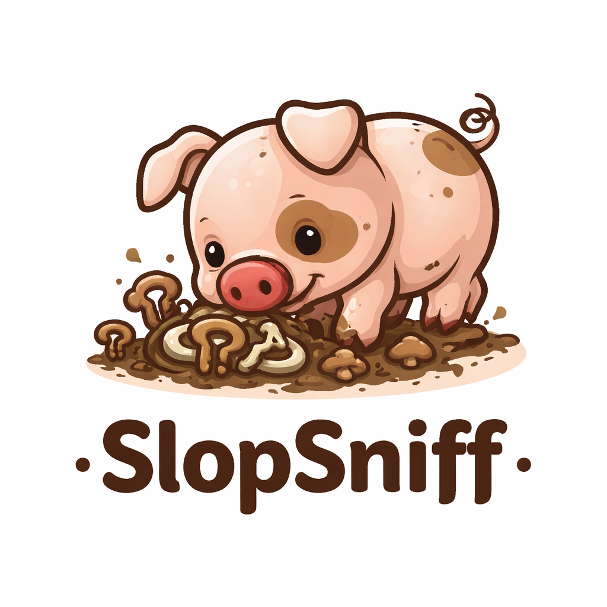

# SlopSniff

<p align="center">
  
</p>

<p align="center">
  <a href="https://pypi.org/project/slopsniff/"></a>
  <a href="https://pypi.org/project/slopsniff/"></a>
  <a href="https://github.com/joshuagilley/slopsniff/actions/workflows/ci.yml"></a>
  <a href="https://pypi.org/project/slopsniff/"></a>
</p>

<p align="center">
  <strong><a href="https://pypi.org/project/slopsniff/">pypi.org/project/slopsniff</a></strong>
</p>

A lightweight CLI for catching "slop" in modern codebases before it hardens into team-wide tech debt.

SlopSniff is not trying to detect whether code was written by AI. It is trying to detect the kinds of patterns that show up when teams move too fast, overgenerate code, or skip the cleanup pass — giant files, copy-pasted functions, versioned helper sprawl, and everything else that quietly becomes the norm.

---

## Install

```bash
pip install slopsniff
```

Or with `uv`:

```bash
uv add slopsniff
```

The default CLI output uses [Rich](https://github.com/textualize/rich) for panels, colors, and wrapping in the terminal. Use `--format json` for plain machine-readable output, or set `NO_COLOR` if you need unstyled text.

---

## Usage

```bash
# Scan current directory
slopsniff .

# Scan a specific path
slopsniff ./src

# Set a custom CI fail threshold (default: 20)
slopsniff . --fail-threshold 30

# JSON output for machines and CI pipelines
slopsniff . --format json

# Show score contribution per finding
slopsniff . --verbose

# Override thresholds on the fly
slopsniff . --max-file-lines 300 --max-function-lines 40
```

### All flags

| Flag                   | Short | Default    | Description                              |
| ---------------------- | ----- | ---------- | ---------------------------------------- |
| `path`                 |       | `.`        | Directory to scan                        |
| `--fail-threshold`     | `-t`  | `20`       | Score at which CI returns exit code 1    |
| `--format`             | `-f`  | `terminal` | Output format: `terminal` or `json`      |
| `--verbose`            | `-v`  | off        | Show score per finding                   |
| `--max-file-lines`     |       | `400`      | Override file line warning threshold     |
| `--max-function-lines` |       | `50`       | Override function line warning threshold |

---

## Example output

```
SlopSniff Report
========================================
Files scanned:  42
Total score:    18
Status:         WARNING

[HIGH] duplicate-functions
  src/utils/formatters.py:12-44
  Duplicate function body found in 2 locations: src/utils/formatters.py:12-44, src/services/formatters.py:8-40

[MEDIUM] large-function
  src/api/upload.py:77-156
  Function 'process_upload' is 79 lines long (warning threshold: 50)

[LOW] large-file
  src/helpers/common.py
  File is 438 lines long (warning threshold: 400)
```

---

## Scoring

Each finding contributes to a total slop score.

| Severity | Score |
| -------- | ----- |
| high     | 10    |
| medium   | 5     |
| low      | 2     |

| Score range | Status               |
| ----------- | -------------------- |
| 0–9         | healthy              |
| 10–19       | warning              |
| 20+         | fail (non-zero exit) |

The fail threshold is configurable via `--fail-threshold`.

---

## Rules

### `large-file`

Flags files that exceed configurable line count thresholds **only for code-like extensions** (`.py`, `.js`, `.ts`, `.tsx`, `.jsx`, `.vue`). Long markdown, HTML, MDX, plain text, etc. are still scanned by other rules (e.g. `exposed-secrets`) but do not trigger `large-file`, since huge docs are normal.

- **medium** at 400+ lines (code files only)
- **high** at 800+ lines (code files only)

### `large-function`

Flags functions that exceed configurable line count thresholds. Uses Python's `ast` module for accurate line spans in `.py` files, and brace-depth heuristics for JS/TS/Vue.

- **medium** at 50+ lines
- **high** at 100+ lines

### `duplicate-functions`

Normalizes and hashes function bodies, then flags exact duplicates found across or within files. Functions under 5 lines are ignored to reduce noise from trivial patterns like empty `__init__` methods.

- **high** for any exact body match across 2+ locations

### `helper-sprawl`

Flags two categories of low-cohesion patterns:

1. **Generic filenames** — files named `utils.py`, `helpers.py`, `common.py`, `shared.py`, `misc.py`, etc.
2. **Versioned function names** — clusters of functions sharing a base name with variant suffixes like `_v2`, `_old`, `_safe`, `_legacy`, `_copy`, `_temp`

- **low** for generic filenames
- **medium** for versioned function name clusters

### `exposed-secrets`

Line-based heuristics for strings that **look like real credentials** (PEM private key headers, AWS key IDs, GitHub PATs, Slack/Stripe/OpenAI/Anthropic/Google/SendGrid-style tokens). Intended to catch accidents like pasting env vars into a blog post, component, or markdown file—not to prove a string is a live secret.

- **high** for any line matching one of the built-in patterns (rotate the credential even if it was “just for a screenshot”)

### Inline suppressions (`slopsniff: ignore`)

After you review a line and accept the risk (e.g. a **test fixture** that intentionally looks like a secret), add a pragma **on that same line**. SlopSniff matches the text anywhere on the line, so this works in Python (`#`), JS/TS (`//`), HTML, markdown, etc.

| Pragma                                          | Effect                                                                      |
| ----------------------------------------------- | --------------------------------------------------------------------------- |
| `slopsniff: ignore`                             | Skips **all** rules that honor this pragma (today: `exposed-secrets` only). |
| `slopsniff: ignore exposed-secrets`             | Skips only the `exposed-secrets` rule on that line.                         |
| `slopsniff: ignore exposed-secrets, large-file` | Skips the listed rule ids (comma-separated).                                |

**Re-checking after edits:** There is no stored fingerprint. If you change the line—remove the pragma, change the token, or rewrite the line—the next scan applies the usual rules again. Prefer the **rule-specific** form so other checks can still run if more rules adopt the same pragma later.

Examples:

```python
FAKE_KEY = "AKIA" + "0" * 16  # slopsniff: ignore exposed-secrets
```

```typescript
const demo = "ghp_" + "a".repeat(36); // slopsniff: ignore exposed-secrets
```

---

## Language support

| Language   | Parser              | Function detection                                    |
| ---------- | ------------------- | ----------------------------------------------------- |
| Python     | `ast` module        | Full — accurate line spans, nested functions          |
| JavaScript | Regex + brace depth | Heuristic — `function`, arrow functions, `const fn =` |
| TypeScript | Regex + brace depth | Same as JS                                            |
| TSX        | Regex + brace depth | Same as JS                                            |
| JSX        | Regex + brace depth | Same as JS                                            |
| Vue        | Regex + brace depth | Same as JS                                            |
| Markdown   | —                   | No function rules; `exposed-secrets` scans lines      |
| MDX        | —                   | Same as Markdown                                      |
| HTML       | —                   | Same as Markdown                                      |

---

## Architecture

```
Walk repo
  └── Filter by extension, skip excluded dirs
        └── Parse each file into FileContext
              ├── python_ast.py  →  ast.FunctionDef extraction
              └── text_parser.py →  regex + brace-depth heuristics
                    └── Run per-file rules
                          ├── LargeFileRule
                          ├── LargeFunctionRule
                          ├── HelperSprawlRule (filename check)
                          └── ExposedSecretsRule (line regexes)
                    └── Run cross-file rules (after all files parsed)
                          ├── DuplicateFunctionsRule (hash map)
                          └── HelperSprawlRule (versioned name clusters)
                                └── Aggregate findings
                                      └── Compute score → ScanResult
                                            └── Reporter (terminal | json)
                                                  └── Exit 0 or 1
```

### Data model

```python
@dataclass
class Finding:
    rule_id: str
    severity: str        # "low" | "medium" | "high"
    file_path: str
    line_start: int | None
    line_end: int | None
    message: str
    score: int

@dataclass
class ScanResult:
    findings: list[Finding]
    total_score: int
    files_scanned: int
    passed: bool
```

### Rule interface

Each per-file rule implements:

```python
def run(self, file_context: FileContext) -> list[Finding]: ...
```

Each cross-file rule implements:

```python
def run_cross_file(self, contexts: list[FileContext]) -> list[Finding]: ...
```

Rules are plain classes — no magic, no registration, easy to test in isolation.

---

## File structure

```
slopsniff/
├── pyproject.toml
├── README.md
├── scripts/
│   └── release.py        # Optional: bump, lock, push, tag, gh release
├── src/
│   └── slopsniff/
│       ├── __init__.py
│       ├── cli.py          # Typer entrypoint
│       ├── config.py       # Config dataclass and defaults
│       ├── models.py       # Finding, FunctionInfo, FileContext, ScanResult
│       ├── scanner.py      # Scan pipeline orchestration
│       ├── scoring.py      # compute_score(), grade()
│       ├── walker.py       # Repo traversal with filtering
│       ├── pragma.py       # slopsniff: ignore parsing
│       ├── parsers/
│       │   ├── python_ast.py   # ast-based Python parser
│       │   └── text_parser.py  # Regex/brace parser for JS/TS/Vue
│       ├── reporters/
│       │   ├── terminal.py     # Rich terminal UI
│       │   └── json_reporter.py
│       └── rules/
│           ├── base.py                  # PerFileRule / CrossFileRule protocols
│           ├── large_file.py
│           ├── large_function.py
│           ├── duplicate_functions.py
│           ├── exposed_secrets.py
│           └── helper_sprawl.py
└── tests/
    ├── test_walker.py
    ├── test_large_file.py
    ├── test_large_function.py
    ├── test_duplicate_functions.py
    ├── test_exposed_secrets.py
    ├── test_helper_sprawl.py
    └── test_pragma.py
```

---

## Using SlopSniff in CI

### GitHub Actions

```yaml
name: SlopSniff

on:
  pull_request:
  push:
    branches: [main]

jobs:
  slopsniff:
    runs-on: ubuntu-latest
    steps:
      - uses: actions/checkout@v4

      - uses: actions/setup-python@v5
        with:
          python-version: "3.13"

      - name: Install SlopSniff
        run: pip install slopsniff

      - name: Run SlopSniff
        run: slopsniff . --fail-threshold 20
```

SlopSniff returns exit code `1` when the total score meets or exceeds the threshold, making it a drop-in CI gate.

---

## Development

```bash
# Clone and install with dev deps
git clone https://github.com/joshuagilley/slopsniff
cd slopsniff
uv sync --dev

# Git hooks (ruff, slopsniff self-check, pytest)
pre-commit install

# Run tests
uv run pytest

# Lint
uv run ruff check .

# Run CLI locally
uv run slopsniff .
```

Pre-commit runs **`uv run slopsniff . --fail-threshold 30`** (same bar as CI’s self-check job), so the CLI comes from this repo’s editable install—no separate PyPI pin. Run `uv sync --dev` before commits so the hook’s `uv run` sees the project.

---

## Release to PyPI

CI is defined in [`.github/workflows/publish.yml`](.github/workflows/publish.yml). It runs when a **GitHub Release is published** (not when you only push a tag). The publish job checks out **the commit that the release’s tag points to**, runs `uv build`, and uploads to PyPI with [trusted publishing](https://docs.pypi.org/trusted-publishers/) (OIDC). Configure the publisher on PyPI once, and use the GitHub `release` environment if you add approval rules.

### Flow (every new version)

1. **Land work on `main`** — Use a feature branch and PR; merge after CI is green.
2. **Update local `main`** — `git checkout main && git pull origin main`.
3. **Bump the version** — Set `[project].version` in `pyproject.toml` to the new semver (e.g. `0.1.6`). Keep `src/slopsniff/__init__.py` `__version__` in sync if you expose it.
4. **Refresh the lockfile** — `uv lock` (this repo vendors the package in `uv.lock`).
5. **Commit and push `main`** — Stage `pyproject.toml`, `uv.lock`, `src/slopsniff/__init__.py`, and anything else you changed; commit (e.g. `chore: release 0.1.6`); `git push origin main`.
6. **Tag that exact commit** — Tag name must match the version: `v` + semver (`v0.1.6` for `0.1.6`). Create the tag on the commit you just pushed (the one containing the version bump).
7. **Push the tag** — `git push origin v0.1.6`.
8. **Create and publish a GitHub Release** for that tag — This triggers the workflow.

### Scripted release

From repo root, on **`main`**, with a **clean** working tree (`git status` empty):

```bash
./scripts/release.py 0.1.7
# or: uv run python scripts/release.py v0.1.7
```

This runs: `git pull origin main` → bump `pyproject.toml` and `src/slopsniff/__init__.py` → `uv lock` → commit `chore: release …` → push `main` → tag `v…` → push tag → `gh release create` with `--generate-notes` (triggers PyPI publish).

| Flag | Meaning |
| ---- | ------- |
| `--dry-run` | Print steps only; no file or git changes. |
| `--no-pull` | Skip `git pull origin main`. |
| `--allow-dirty` | Allow a dirty tree before bump (use carefully). |
| `--notes-file PATH` | Use this file for release notes instead of `--generate-notes`. |
| `--expect-repo OWNER/REPO` | Abort unless `gh repo view` matches (see **Who can run this?**). |

**Who can run this?** Anyone can clone the repo and run the script locally; that does **not** publish anything to *your* PyPI project. Pushing to **your** `main`, tagging, and creating a **GitHub Release** requires **your** GitHub permissions. PyPI only accepts uploads from the [trusted publisher](https://docs.pypi.org/trusted-publishers/) you configured for this repo’s workflow—forks and random contributors do not get OIDC tokens for your package.

**Optional mistake-guard:** Set `SLOPSNIFF_RELEASE_EXPECT_REPO=joshuagilley/slopsniff` in your shell profile (or pass `--expect-repo joshuagilley/slopsniff`) so the script exits if `gh` is pointed at a fork or wrong clone. On GitHub, use **branch protection** on `main` and (recommended) an **environment** with required reviewers for the `release` job so publishes are not silent.

Needs **`git`**, **`uv`**, and **`gh`** logged in. If a release for that tag already exists, `gh release create` will fail with 422—use **Actions → Re-run** for that release instead.

**CLI (steps 6–8) by hand:**

```bash
# After steps 1–5: main on GitHub includes the version bump (pyproject.toml, uv lock, etc.).
# New PyPI files need a NEW tag/version—do not re-run an old release to “fix” a failed upload.
# If gh release create says tag_name already exists, use Actions → Re-run on that release instead.
git tag v0.1.6
git push origin v0.1.6
gh release create v0.1.6 --title "0.1.6" --notes "What changed in this release."
```

**UI:** GitHub → **Releases** → **Draft a new release** → choose tag `v0.1.6` → **Publish release**.

### If PyPI upload fails (`HTTPError: 400 Bad Request`)

PyPI rejects uploads when a **file name already exists** (e.g. `slopsniff-0.1.6-py3-none-any.whl`). That version is already published; you cannot replace it by re-running CI.

- **Fix:** Bump to a **new** semver in `pyproject.toml`, push `main`, then a **new** tag and **new** GitHub Release (`v0.1.7`, etc.). Deleting a GitHub Release does **not** remove files from PyPI.

### If `gh release create` fails (`HTTP 422: Release.tag_name already exists`)

A **GitHub Release** already exists for that tag. You cannot create a second one with the same name.

- **To retry PyPI only:** Actions → **Publish to PyPI** → open the run for that release → **Re-run failed jobs** (or re-run all). That still builds the **tag’s commit**—it does not read latest `main`.
- **To ship new code:** New version in `pyproject.toml`, new tag, new release (see flow above).

### Re-running workflows vs. new versions

**Re-run** uses the **same tag and commit** as the original release event. It never picks up newer commits on `main`. If you need different artifacts on PyPI, you need a **new version number**, **new tag**, and **new release**.

---

## Defaults reference

| Setting                      | Default                                                                       |
| ---------------------------- | ----------------------------------------------------------------------------- |
| Max file lines (warning)     | 400                                                                           |
| Max file lines (high)        | 800                                                                           |
| Max function lines (warning) | 50                                                                            |
| Max function lines (high)    | 100                                                                           |
| Fail threshold               | 20                                                                            |
| Included extensions          | `.py` `.js` `.ts` `.tsx` `.jsx` `.vue` `.md` `.mdx` `.html`                   |
| `large-file` extensions      | `.py` `.js` `.ts` `.tsx` `.jsx` `.vue` only                                   |
| Excluded directories         | `.git` `node_modules` `.nuxt` `dist` `build` `.venv` `coverage` `__pycache__` |

---

## Roadmap

- [ ] `.slopsniff.toml` config file support
- [ ] `--changed-only` mode via `git diff`
- [ ] Near-duplicate detection (token fingerprints / MinHash)
- [ ] Tree-sitter integration for accurate multi-language AST
- [ ] GitHub PR annotation support
- [ ] Score baselining for legacy repos
- [x] Inline suppressions (`slopsniff: ignore` — see **Inline suppressions** under Rules)
- [ ] Homebrew tap
